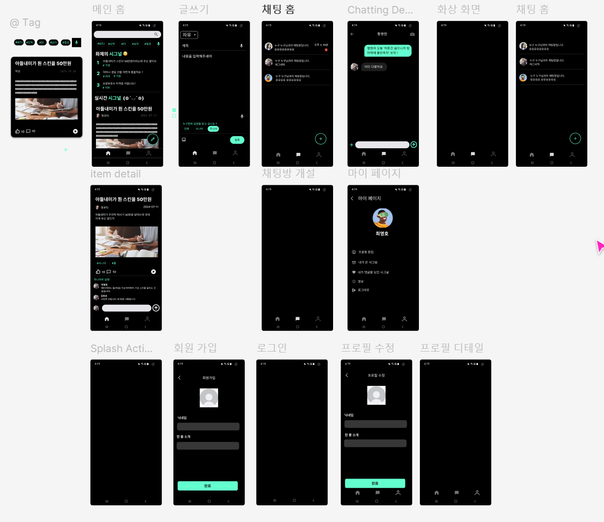

# 모바일 프로젝트(시그널-Signal)

<!-- 필수 항목 -->

## 카테고리

| Application | Domain | Language | Framework |
| ---- | ---- | ---- | ---- |
| :black_square_button: Desktop Web | :white_check_mark: AI | :black_square_button: JavaScript |:black_square_button: Vue.js |
| :white_check_mark: Mobile Web | :black_square_button: Big Data | :black_square_button: TypeScript | :black_square_button: React |
| :black_square_button: Responsive Web | :black_square_button: Blockchain | :black_square_button: C/C++ | :black_square_button: Angular |
| :white_check_mark: Android App | :black_square_button: IoT | :black_square_button: C# | :black_square_button: Node.js |
| :black_square_button: iOS App | :black_square_button: AR/VR/Metaverse | :white_check_mark: Python | :white_check_mark: MariaDB |
| :black_square_button: Desktop App | :black_square_button: Game | :white_check_mark: Java | :white_check_mark: Spring/Springboot |
| | | :white_check_mark: Kotlin | :white_check_mark: AndroidStudio  |

<!-- 필수 항목 -->

## 프로젝트 소개

* 프로젝트명: 시그널(Signal)
* 팀명 : 온고지신溫故知新(옛 것을 먼저 충분히 익히고 그것을 바탕으로 새로운 것을 익힌다 )
* 서비스 특징: [세대 간 정보 공유 서비스]
* 주요 기능
  - 주니어와 시니어세대들의 고민거리 공유 기능 제공
  - 실시간 채팅 기능 제공
  - 화상 커피챗 기능 제공
* 주요 기술
  - WebRTC
  - WebSocket
  - STT, TTS
  - REST API
* 참조 리소스
  * Vuetify: 디자인 전반 적용
  * Vue Argon Design System: 디자인 전반 적용
  * Vue Black Dashboard Pro(유료): 캘린더 컴포넌트 사용
  * AR Core: 구글에서 제공하는 AR 지원 라이브러리. 이미지 인식 및 오버레이 영상에 활용
  * Color Thief: 이미지 색상 추출 라이브러리. 커버 사진 색상 추출 및 배경 변경에 활용
  * Animation.css: CSS 애니메이션 지원 라이브러리. 메인 페이지 진입 애니메이션에 활용
* 배포 환경
  - URL: // 웹 서비스, 랜딩 페이지, 프로젝트 소개 등의 배포 URL 기입
  - 테스트 계정: // 로그인이 필요한 경우, 사용 가능한 테스트 계정(ID/PW) 기입

<!-- 자유 양식 -->

## 팀 소개
* 김민수: 팀장, 백엔드 개발
* 김민조: 부팀장, 프론트엔드 테크리더
* 강인수: 백엔드 개발, 백엔드 테크리더
* 황병현: 백엔드 개발, 아이디어 기획
* 최지훈: 프론트앤드 개발, QA
* 최영호: 프론트앤드 개발, 서기

## 팀 Ground Rule
* 🍎 사소한 이슈 편하게 얘기하기
* 🍪 고민거리가 1시간 넘어가면 얘기하기
* 🗣 정기회의 일주일에 2번, 한달 8번 중 지각 2번은 OK but 그 이후에는 커피 사기
* ⚠️ 최소 수면 시간 보장하기(1~7시는 대답 없어도 인정) + 공지 확인 후에 ✅ 체크 필수
* 📝 폭력과 욕설 자제하기
* 🤑 BE와 FE 각자의 포지션 내에서 코드 리뷰 진득하게 하기(진행 시 정말 잘했는데! 로 미사어구 붙여서 시작하기)
<!-- 자유 양식 -->

## 회의록
https://www.notion.so/ab2b24d6f5804166a9dd827357f19661

## 프로젝트 상세 설명

// 개발 환경, 기술 스택, 시스템 구성도, ERD, 기능 상세 설명 등
## 프로젝트 ERD 이미지

## 프로젝트 Figma 이미지

## commit convention
- ⭐feat : 기능 (새로운 기능)
- 🛠fix : 버그 (버그 수정)
- ⚒refactor : 리팩토링
- 🎨design : CSS 등 사용자 UI 디자인 변경
- 💬comment : 필요한 주석 추가 및 변경
- 🖍️style : 스타일 (코드 형식, 세미콜론 추가: 비즈니스 로직에 변경 없음)
- ✏docs : 문서 수정 (문서 추가, 수정, 삭제, README)
- 📋test : 테스트 (테스트 코드 추가, 수정, 삭제: 비즈니스 로직에 변경 없음)
- 👏chore : 기타 변경사항 (빌드 스크립트 수정, assets, 패키지 매니저 등)
- 📃init : 초기 생성
- 🔙rename : 파일 혹은 폴더명을 수정하거나 옮기는 작업만 한 경우
- ✂remove : 파일을 삭제하는 작업만 수행한 경우

## 7.15(월) ~ 7.19(금) 2주차 기여도 정리

| 날짜 | 전체 | 김민수 | 강인수 | 황병현 | 김민조 | 최영호 | 최지훈 |
| --- | --- | --- | --- | --- | --- | --- | --- |
| 07/15 | JIRA 설정 완료 및 개인별 작업 부여 완료 | 전체 일정 관리, SpringBoot강의 교육 | Jira 설정, 채팅 dto, entity 클래스 정의 | Jira member 작성, Member entity 설계, ERD 수정 | Gradle 셋팅, 매칭 메인 화면 설계, Splash Activity 학습 , Hilt Setting |  jira 작성 및 git 세팅 (깃 날려먹을 뻔함) | JIRA 일정 설정 및 안드로이드 프로젝트 기본 설정 |
| 07/16 | FE UI 메인화면 및 시스템설정 UI 구현, BE 게시판 및 회원 API 구현 | 게시글 작성, 조회 및 전체 일정 관리 | 채팅방 테이블 생성, 채팅방 생성 후 DB 저장 기능 추가 | Member Controller, service, repository 작성 | Splash Activity 완료, 회원 가입, 로그인 ,프로필 수정, 마이 UI 작성 | chat home 화면 구성 및 item 구성 완료 (이벤트 연결 x) | Main 화면 UI 작성 및 디자인 |
| 07/17 | 개인 별 부여된 작업 진행 및 일정 회의 | 게시글 수정, 삭제 구현 및 전체 일정 관리 | 메세지 송신 및 수신 기능 테스트 | token 생성, DB연결 및 조회 | my 화면 , 회원가입 UI 적용 | room db 세팅 | 무한 스크롤 구현 및 게시글 화면 UI 작성 |
| 07/18 | 개인 별 부여된 작업 진행 및 일정 회의 | 댓글 CRUD 구현 및 전체 일정 관리 | 인증된 사용자만 채팅방에 참여할 수 있는 비지니스 로직 추가 | spring security & jwt연동, access token 생성 | 프로필 수정, 매칭화면 애니 적용 | stomp 연결 확인 및 room db 세팅 정리 | 메인 화면 UI 수정 및 기타 자잘한 사항들 수정 |
| 07/19 | 개인 별 부여된 작업 진행 및 일정 회의 | S3버킷 SpringBoot연동 및 이미지 테이블 작성 | 리뷰 작성 기능 추가 및 위치 정보 저장 기능 추가 | bearer token 수정, 로그아웃 구현 | 매칭 요청 애니메이션 구현, 레이더 애니메이션 구현 | stomp 연결 및 테스트 | TTS, STT 기능 구현 및 적용 |

## 7.22(월) ~ 7.26(금) 3주차 기여도 정리

| 날짜 | 전체 | 김민수 | 강인수 | 황병현 | 김민조 | 최영호 | 최지훈 |
| --- | --- | --- | --- | --- | --- | --- | --- |
| 07/22 | 회의 후 개별 작업 진행 | 파일 패키지 생성 및 업로드 구현 | 매칭 거리 계산 기능 구현 | report table 구현, report controller구현 | 푸시 알림 서비스 학습 및 구현
리뷰 화면 UI 구현 | room db 재 설계 및 db 코루틴 설정 | 화면 구성 변경 및 카메라, 갤러리 이미지 가져오기 구현 |
| 07/23 | 회의 후 개별 작업 진행 | File Entity 재 작성 및 Tag Entity 생성 | 매칭될 수 있는 유저 목록 조회하는 기능 추가 |  forigen key 연결, User 보안 점검 | 내가 쓴 시그널 UI 작업,  푸시 알림 구현 | 채팅 메시지 말풍선 이미지 넣기 및 채팅 수진에 따른 처리 로직 작성 | 서버와 연결, 화면 UI 수정 |
| 07/24 | 회의 후 개별 작업 진행 | 컨디션 난조로 오전 작업 후 조퇴 | FCM을 이용한 알림 전송 기능 추가 | Docker 올리기 | 매칭 api 연결 및 ui 작업 | stomp 연결해서 db에 넣는 작업 및 실시간 채팅 구성 | 앱 UI 동작 테스트 및 수정 |
| 07/25 | 회의 후 개별 작업 진행 | Board, Comment에 userId추가 후 게시글 작성 테스트 | 매칭 API 테스트 | CI/CD(jenkins) 설계 | 매칭 신청 + 수락 연결 , 로그인 API 연결  | 채팅 부분 api 연결 및 테스트 & 발표 ppt 제작 | 게시글 작성 기능 구현 및 서버 연결 |
| 07/26 | 회의 후 개별 작업 진행 | Board 프론트와 연결 테스트 및 Dto 수정 | 코딩 테스트 참여로 인한 결석 | CI/CD(jenkins) 설계2 | 매칭 커스텀뷰 작업 | 발표 및 채팅 부분 파일 구조 변경 | 서버와 통신 및 댓글 CR 기능 구현 |
